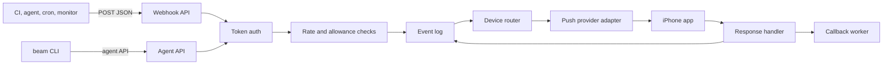
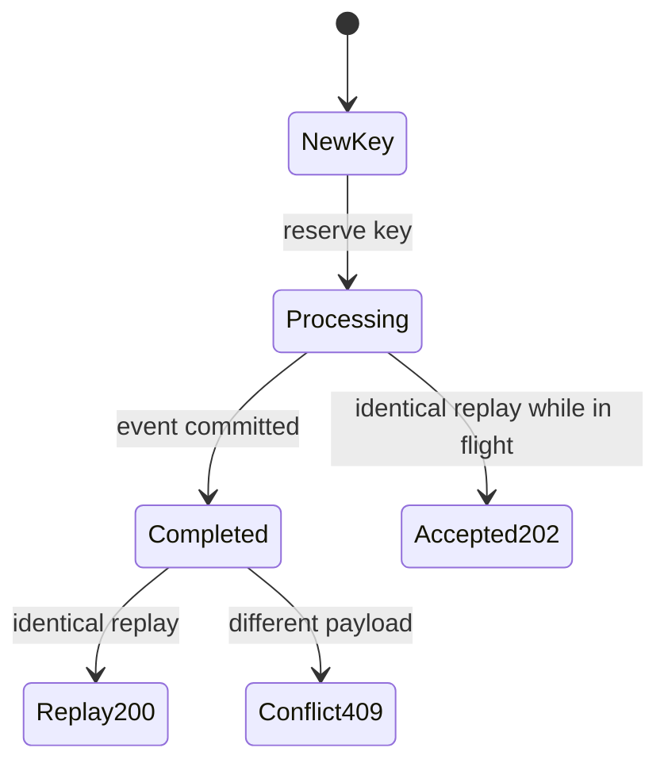
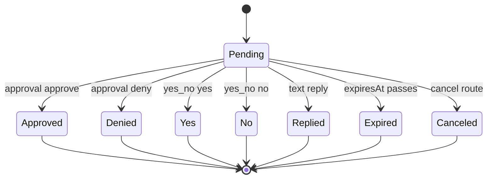
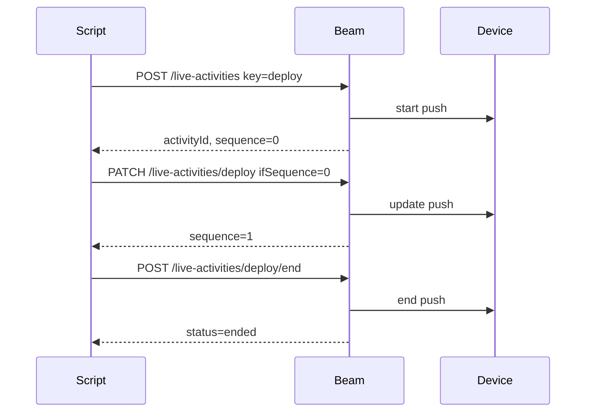

# Beam product goal

Beam should become a self-hostable, clean-room implementation of the public
Hark product shape: webhook URLs that turn machine events into phone
notifications, optional human responses, Live Activity-style progress cards,
and a script-friendly CLI. The implementation must keep its own identity,
terminology, code, docs, and product packaging while matching the behavioral
coverage described by the public Hark documentation.

This document is intentionally verbose. It is the product goal, feature map,
and acceptance target for evolving Beam from the current in-memory development
server into a production-grade service.

## Source-derived scope

The Hark docs describe two webhook APIs authenticated by a secret token:
one-shot notifications and stateful Live Activities. They also describe a CLI
surface for terminal agents and scripts, including browser-based auth, service
creation, notifications, interactive questions, Live Activity commands, and
branchable exit codes.

Beam should cover the same problem space without copying source code or brand
identity:

- service-branded webhook endpoints
- token rotation and unknown-token failure behavior
- one-shot notification delivery
- service defaults for title, avatar, and tap URL
- optional device routing
- rate limits by service and account
- monthly notification allowance accounting
- idempotent writes with conflict detection
- interactive approval, yes/no, and text responses
- response polling, cancellation, expiry, and callback delivery
- stateful Live Activity start, read, update, and end routes
- Live Activity progress fields, layouts, privacy modes, staleness, expiry,
  replacement, and sequence conflicts
- CLI auth, service management, notification sends, prompts, activity control,
  JSON stdout, stderr diagnostics, environment overrides, and exit codes

## Product principles

Beam should be boring to call from automation and explicit when something is
unsafe.

- Credentials are treated as bearer secrets and never logged.
- Every successful CLI command prints exactly one JSON object to stdout.
- Diagnostics go to stderr.
- Idempotency is scoped to a service or agent connection.
- API errors are structured and branchable by code, not message text.
- Missing devices do not fail a build unless the caller asks for strictness.
- Webhook URLs are persistent integration credentials, not user session tokens.
- Device routing, callbacks, and advanced interactions are plan-gated in the
  domain model even if the open-source server ships with permissive defaults.
- Live Activity writes are sequence-aware and tolerate retrying.

## System map

## Repository goal

The repo should stay small at the root and detailed under `docs/`.

- `README.md` stays a slim entry point: what Beam is, install, commands, docs.
- `SPEC.md` remains the verbose goal and acceptance target.
- `docs/api.md` owns route-level details.
- `docs/cli.md` owns terminal behavior.
- `docs/architecture.md` owns system design and diagrams.
- `docs/ci.md` owns quality gates and LOC budgets.

## Milestone 1: local development server

Current Beam already starts here.

Acceptance:

- `beam serve` runs a local HTTP server.
- `dev_token` is registered for local sends.
- `POST /hooks/dev_token` creates an event.
- idempotency replays matching payloads and rejects changed payloads.
- `GET /hooks/:token/events/:eventId` reads events.
- `POST /hooks/:token/events/:eventId/cancel` cancels pending responses.
- Live Activity start, read, update, and end routes work in memory.
- `beam notify`, `beam ask`, and `beam activity` commands call the API.
- tests cover notification send, idempotency conflict, and activity lifecycle.

## Milestone 2: durable backend

Beam needs persistent state before it can be a real service.

Acceptance:

- services, webhook tokens, agent connections, devices, events, interactions,
  activities, idempotency records, and callback attempts persist in a database.
- migrations are checked into the repo.
- tokens are stored hashed, with plaintext shown only at creation/rotation.
- event logs retain provider diagnostics without returning sensitive provider
  tokens to API callers.
- tests can run against an ephemeral database.

## Milestone 3: service dashboard API

The product needs service management even if the first UI is not in scope.

Acceptance:

- create, list, update, and delete services.
- rotate webhook tokens.
- set default title, image URL, and tap URL.
- list recent event history.
- list devices and stable device IDs.
- revoke agent connections.

## Milestone 4: notification API parity

Notification sends must match the documented contract.

Acceptance:

- `body` is required and trims to 1..2,000 characters.
- `title` accepts up to 80 characters and defaults to the service title.
- `imageUrl` accepts public HTTPS URLs and rejects localhost, `.local`,
  loopback, link-local, and private IP ranges.
- `url` accepts only HTTP and HTTPS.
- `deviceIds` accepts 1..50 owned device IDs when device routing is enabled.
- unknown or rotated webhook tokens return `404`.
- invalid payloads return `400` with field issues.
- device routing without entitlement returns `402`.
- rate limits return `429` with retry hints when applicable.
- provider-wide failure can return `502`.
- no registered device returns success with `delivered: 0` and a message.

## Milestone 5: idempotency

Idempotency must be safe for unreliable networks and CI retries.

Acceptance:

- `Idempotency-Key` is optional.
- blank or over-length keys return `400`.
- keys are scoped per service or agent connection.
- matching payload replays the original response with `idempotent: true`.
- matching payload while the first request is in flight returns `202`.
- changed payload under the same key returns `409`.
- idempotency records expire on a documented retention schedule.

## Milestone 6: interactive responses

Beam should support human-in-the-loop automation.

Acceptance:

- response types: `approval`, `yes_no`, and `text`.
- `expiresInSeconds` accepts 30..86,400 and defaults to 900.
- `correlationId` echoes through read responses and callbacks.
- callback URL must be public HTTPS.
- callback token accepts 16..512 characters.
- read route settles pending responses as expired after `expiresAt`.
- cancel route returns `404` for non-pending responses.
- events from another service are invisible.
- callbacks are at-least-once and keyed by `eventId`.
- callback retries are scheduled immediately, then 30 seconds, 2 minutes,
  10 minutes, and 1 hour.
- expired and canceled prompts do not fire callbacks.

## Milestone 7: Live Activity API

Live Activity state lets scripts display progress instead of sending noisy
updates.

Acceptance:

- start route returns `201`.
- read, patch, and end routes address by generated ID or caller-provided key.
- start requires `title` and `status`.
- update requires at least one field other than `ifSequence`.
- updates merge partial state and increment `sequence`.
- `ifSequence` mismatch returns `409` with current state.
- ended or expired activities reject updates.
- `dismissAfterSeconds` accepts 0..14,400 on end.
- `expiresInSeconds` accepts 60..28,800 and defaults to 28,800.
- `staleAfterSeconds` accepts 0..28,800 and defaults to 14,400.
- progress accepts `null` or 0..1.
- detail accepts `null`.
- symbols include `terminal`, `code`, `build`, `success`, and `warning`.
- layouts include `standard`, `ring`, `hero`, `terminal`, and `steps`.
- privacy modes include `standard` and `private`.
- one Live Activity per target device is enforced.
- `replace: true` ends blocking activities and transfers fixed keys.
- Live Activity operations count against the same rate and monthly budgets as
  notifications.

## Milestone 8: CLI parity

The CLI should be pleasant for terminals, scripts, and coding agents.

Acceptance:

- browser device authorization login.
- auth status and logout.
- local credentials stored with mode `0600`.
- repeatable `--scope`, `--client-name`, and `--expires-in`.
- `BEAM_TOKEN` and `BEAM_API_URL` override config.
- `services create`, `services list`, and token-safe service output.
- `notify <body>` with title, image, URL, device, idempotency key, and stdin.
- `notify ask <prompt>` with approval, yes/no, text, wait, poll, timeout, and
  resumable interaction wait.
- `activity start`, `activity update`, `activity end`, `activity get`, and
  `activity list`.
- exact JSON object to stdout on success.
- exit code `0` for success, approved, yes, or replied.
- exit code `4` for timed out, canceled, or expired.
- exit code `5` for denied or no.
- exit code `7` for no device accepted the push.
- exit codes `1`, `2`, `3`, and `6` for API, usage, auth/scope, and network
  errors.

## Milestone 9: iOS app and provider adapter

Beam needs a mobile app and provider abstraction to deliver real pushes.

Acceptance:

- device registration.
- active/inactive device state.
- iOS-only routing for phone notifications.
- push-to-start token registration for Live Activities.
- provider adapters isolate APNs, Expo, or future push providers.
- provider errors are recorded in the activity log with sensitive tokens
  redacted from caller responses.

## Milestone 10: operations and safety

Production Beam should be observable and maintainable.

Acceptance:

- structured logs with credential redaction.
- metrics for request counts, delivery counts, callback attempts, rate limits,
  provider failures, and latency.
- health and readiness routes.
- documented backup and restore.
- abuse controls for public deployments.
- CI covers tests, race detector, build matrix, lint, vet, vuln checks, docs
  links, and LOC budgets.
