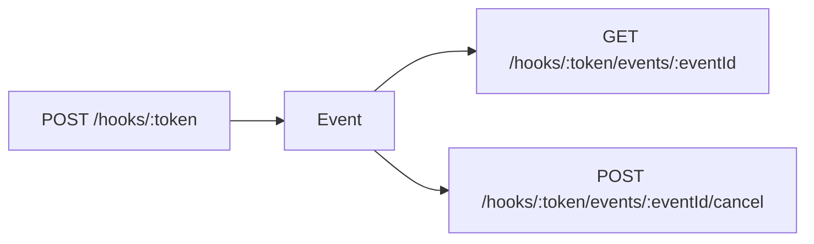
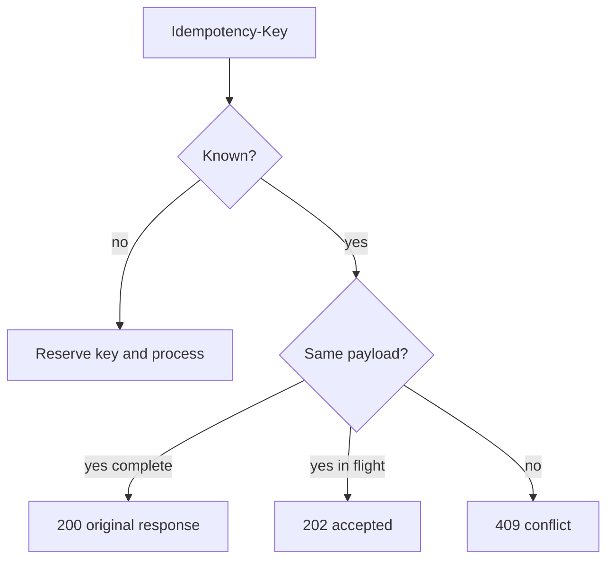
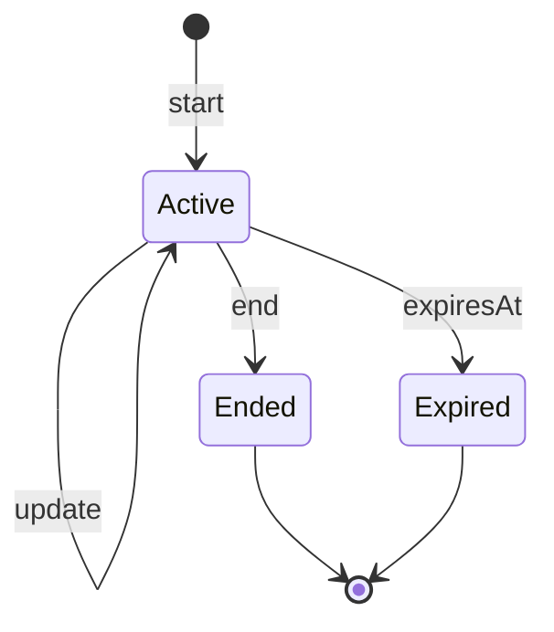

# API

Beam exposes webhook routes under `/hooks/:token`. The token is a bearer secret
for a service. Unknown tokens return `404` with structured JSON.

## Notification API

`POST /hooks/:token` sends a one-shot notification.

| Field | Type | Required | Goal |
|---|---|---:|---|
| `body` | string | yes | 1..2,000 characters after trimming |
| `title` | string | no | Sender override, up to 80 characters |
| `imageUrl` | URL | no | Public HTTPS avatar |
| `url` | URL | no | HTTP/HTTPS tap destination |
| `deviceIds` | string[] | no | 1..50 target devices with routing entitlement |
| `response` | object | no | Interactive response request |

Validation currently rejects blank or over-length bodies, titles over 80
characters, non-public `imageUrl` values, non-HTTP(S) tap URLs, more than 50
target device IDs, unsupported response types, response expiries outside
30..86,400 seconds, callback URLs that are not public HTTPS, and callback
tokens outside 16..512 characters.

## Idempotency

## Interactive responses

Response types are `approval`, `yes_no`, and `text`. Pending responses can be
read, canceled, answered by the device app, or expired by time.

Callbacks are at-least-once. A production worker should retry immediately, then
after 30 seconds, 2 minutes, 10 minutes, and 1 hour.

## Live Activity API

| Route | Purpose |
|---|---|
| `POST /hooks/:token/live-activities` | Start an activity |
| `GET /hooks/:token/live-activities/:id` | Read current state |
| `PATCH /hooks/:token/live-activities/:id` | Merge partial state |
| `POST /hooks/:token/live-activities/:id/end` | End and optionally dismiss |

Activity fields include title, status, detail, progress, symbol, accent color,
style, privacy mode, key, replacement, device routing, staleness, expiry, and
conditional sequence updates.

Validation currently enforces required start title/status, non-empty updates,
progress 0..1, symbols from `terminal`, `code`, `build`, `success`, and
`warning`, styles from `standard`, `ring`, `hero`, `terminal`, and `steps`,
privacy mode `standard` or `private`, expiry 60..28,800 seconds, staleness
0..28,800 seconds, and dismiss delay 0..14,400 seconds on end.
