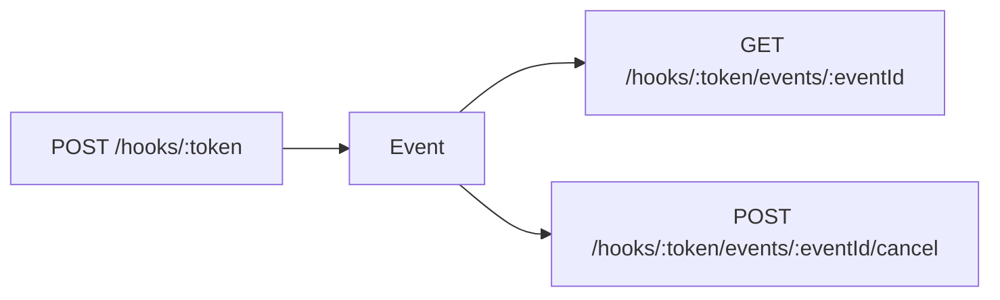
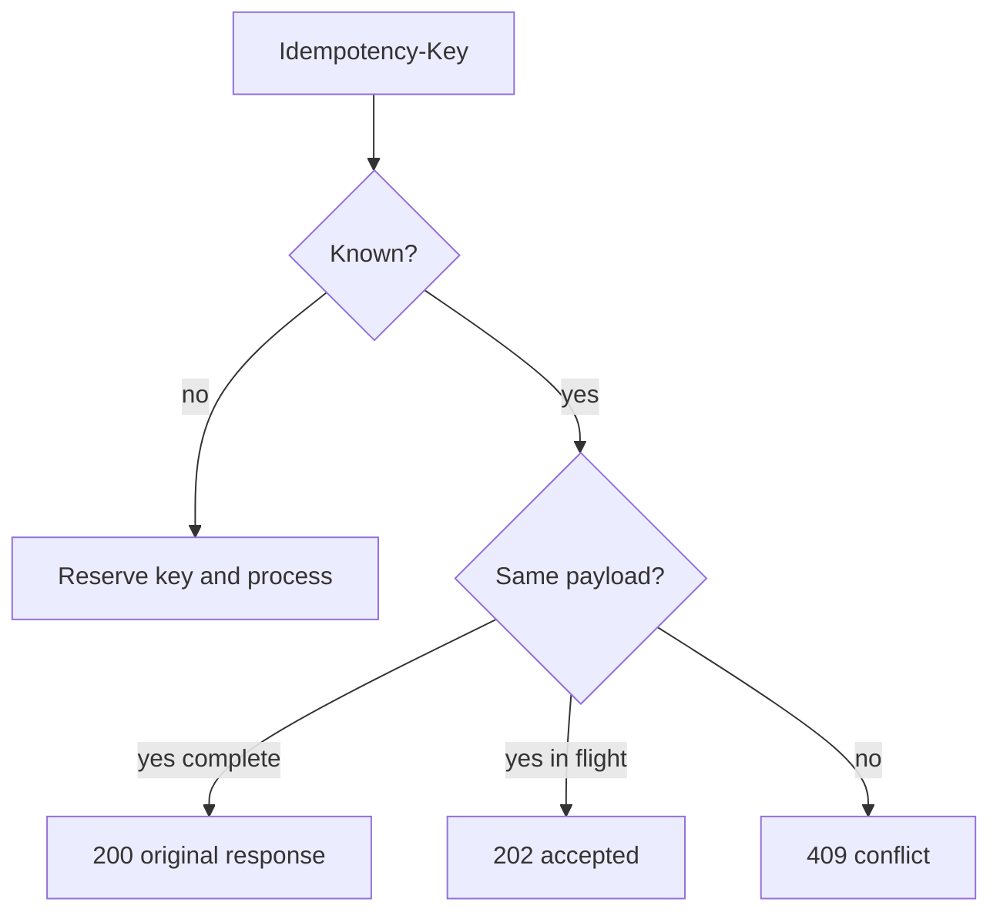
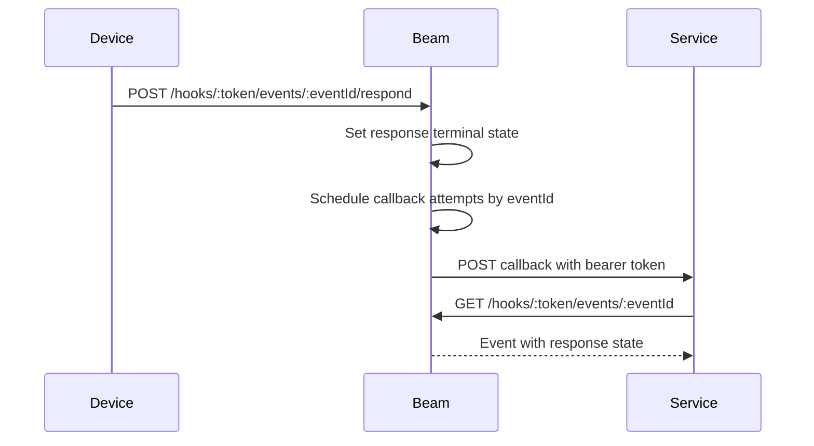
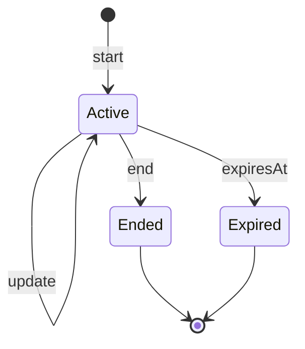

# API

Beam exposes webhook routes under `/hooks/:token`. The token is a bearer secret
for a service. Unknown tokens return `404` with structured JSON.

Operational probes are exposed at `GET /healthz` and `GET /readyz`. Both return
`200 {"ok": true}` when the process is live and ready to serve requests.
`GET /metrics` returns Prometheus text metrics for request count, cumulative
latency, delivery count, scheduled callback attempts, rate-limited responses,
and provider failures.

## Service API

Local development service management lives under `/api/services`.

| Route | Purpose |
|---|---|
| `POST /api/services` | Create a service and return its token once |
| `GET /api/services` | List services without tokens |
| `GET /api/services/:id` | Read one service without its token |
| `PATCH /api/services/:id` | Update title, image URL, or tap URL defaults |
| `DELETE /api/services/:id` | Delete a service |
| `POST /api/services/:id/rotate-token` | Revoke the old webhook token and return a new one once |
| `GET /api/services/:id/events` | List recent token-safe events for one service |
| `GET /api/services/:id/devices` | List stable device IDs and active state |
| `POST /api/services/:id/devices` | Register an iOS device |
| `POST /api/services/:id/devices/:deviceId/deactivate` | Mark a device inactive |

Service list and read responses never include webhook tokens. Tokens are shown
only on create and rotation. Durable snapshots store token hashes, not the
plaintext webhook URLs.

Device registration accepts `name`, `platform: "ios"`, and optional
`pushToStartToken` for Live Activity starts. Device responses never echo the
push-to-start token; they expose `pushToStartTokenRegistered` instead.

Event history is service-scoped, newest first, and limited to the 50 most recent
events. Event responses include delivery, provider diagnostics, and interaction
state but never include webhook tokens, push credentials, or callback bearer
tokens.

## Auth API

Browser/device authorization starts under `/api/auth/device`.

| Route | Purpose |
|---|---|
| `POST /api/auth/device` | Create a device authorization request |
| `GET /api/auth/device/:deviceCode/token` | Poll for approval and token issuance |
| `POST /api/auth/device/:userCode/approve` | Approve a local development device code |
| `POST /api/auth/revoke` | Revoke a device-issued auth token |
| `GET /api/auth/connections` | List token-safe agent connections |
| `POST /api/auth/connections/:id/revoke` | Revoke an agent connection |

Device requests include a user code, verification URL, scopes, client name, and
expiry. Pending token polls do not include a token. Approved polls include the
issued agent token and credential metadata. Management clients send agent tokens
as bearer credentials. When a bearer token is present, `services` scope gates
service management, `auth` scope gates connection listing and revocation, and
`admin`, `*`, or an empty scope list can operate across management surfaces.
Revocation accepts a JSON `token` field or bearer token and returns token-safe
credential metadata. Connection list and revoke responses include connection
IDs, client names, scopes, status, and timestamps, but never include agent
tokens or browser user codes.

## Notification API



`POST /hooks/:token` sends a one-shot notification.

| Field | Type | Required | Goal |
|---|---|---:|---|
| `body` | string | yes | 1..2,000 characters after trimming |
| `title` | string | no | Sender override, up to 80 characters |
| `imageUrl` | URL | no | Public HTTPS avatar |
| `url` | URL | no | HTTP/HTTPS tap destination |
| `deviceIds` | string[] | no | 1..50 target devices with routing entitlement |
| `response` | object | no | Interactive response request |

Validation currently rejects blank or over-length bodies, titles over 80
characters, non-public `imageUrl` values, non-HTTP(S) tap URLs, empty
`deviceIds` arrays, duplicate device IDs, more than 50 target device IDs,
unsupported response types, response expiries outside
30..86,400 seconds, callback URLs that are not public HTTPS, and callback
tokens outside 16..512 characters.

When `deviceIds` is present, it must contain 1..50 unique IDs and every ID must
belong to the target service and be active. Empty lists, duplicates, inactive
devices, or unknown IDs return `400` with a `deviceIds` field error. Services
without the device-routing entitlement return `402` with
`code: "payment_required"`. Without explicit routing, Beam delivers to all
active devices.

Rate and allowance failures return `429` with retry hints:

```json
{
  "ok": false,
  "error": "rate limit exceeded",
  "code": "rate_limit",
  "limit": 600,
  "retryAfter": 30,
  "resetAt": "2026-07-27T21:15:00Z"
}
```

Monthly allowance failures use `code: "monthly_allowance"` and the same
metadata shape. Successful idempotent replays do not consume additional quota.
When no active registered device accepts a notification, the request still
succeeds with `delivered: 0` and a `message` field.
Provider-wide failures from the push-provider boundary return `502` with
`code: "provider_failure"`; provider credentials are not included in caller
responses.
Successful notification events retain token-safe `providerDiagnostics` entries
with provider name, operation, target device ID when applicable, status, reason,
and timestamp.

## Idempotency



Idempotency records are retained for 24 hours. After retention expires, Beam
allows the same key to create a new notification or Live Activity start.
Identical retries while the original write is still processing return
`202 {"ok": true}` until the committed event or activity can be replayed.

## Interactive responses

Response types are `approval`, `yes_no`, and `text`. Pending responses can be
read, canceled, answered by the device app, or expired by time.

| Route | Purpose |
|---|---|
| `GET /hooks/:token/events/:eventId` | Read an event and response state |
| `POST /hooks/:token/events/:eventId/respond` | Settle a pending response |
| `POST /hooks/:token/events/:eventId/cancel` | Cancel a pending response |

`respond` accepts `{"action":"approve"}` or `{"action":"deny"}` for
approval prompts, `{"action":"yes"}` or `{"action":"no"}` for yes/no prompts,
and `{"text":"..."}` for text prompts. The response state preserves
`correlationId` for polling and callback payloads.



Callbacks are at-least-once and keyed by `eventId`. Beam schedules attempts
immediately, then after 30 seconds, 2 minutes, 10 minutes, and 1 hour. Expired
and canceled prompts do not schedule callback attempts. Each due attempt sends
one JSON payload containing `eventId` and the token-safe `event`, with the
callback token supplied as an `Authorization: Bearer ...` header. Attempt state
records `delivered` or `failed`, the HTTP status code when available, and the
delivery timestamp.

## Live Activity API

| Route | Purpose |
|---|---|
| `POST /hooks/:token/live-activities` | Start an activity |
| `GET /hooks/:token/live-activities` | List activities |
| `GET /hooks/:token/live-activities/:id` | Read current state |
| `PATCH /hooks/:token/live-activities/:id` | Merge partial state |
| `POST /hooks/:token/live-activities/:id/end` | End and optionally dismiss |

Live Activity responses include `providerDiagnostics` for start, update, and
end operations plus a `failed` count derived from skipped or failed diagnostic
entries. Delivery is routed through Beam's push-provider interface; the default
local provider records deterministic diagnostics for development, while APNs,
Expo, or other providers can be added behind the same response contract.
End responses include `dismissAt`, computed from `dismissAfterSeconds`, so
callers can tell when devices may remove the completed activity.



Activity fields include title, status, detail, progress, symbol, accent color,
style, privacy mode, key, replacement, device routing, staleness, expiry, and
conditional sequence updates.

Starting an activity with an active fixed `key` returns `409 conflict` unless
the request includes `replace: true`. Replacement ends the blocking activity
and transfers key-based reads, updates, and end requests to the newly created
activity ID.

Activity starts may include `deviceIds` with the same ownership, active-device,
and routing-entitlement rules as notifications. Without `deviceIds`, Beam
targets every active device on the service. Beam allows only one active Live
Activity per target device; overlapping starts return `409 conflict` unless
`replace: true` ends the blocking activity first.

When `ifSequence` does not match the current activity sequence, update and end
requests return `409 conflict` with `ok: false`, an error message, and the
current activity response fields so callers can retry from the latest state.

Live Activity start, update, and end writes consume the same rate and monthly
operation budgets as notification sends.

Validation currently enforces required start title/status, non-empty updates,
progress 0..1, symbols from `terminal`, `code`, `build`, `success`, and
`warning`, styles from `standard`, `ring`, `hero`, `terminal`, and `steps`,
privacy mode `standard` or `private`, expiry 60..28,800 seconds, staleness
0..28,800 seconds, and dismiss delay 0..14,400 seconds on end. On update,
explicit `staleAfterSeconds: 0` is accepted and marks the activity stale
immediately; omitting the field leaves the existing `staleAt` unchanged.
Explicit `detail: null` and `progress: null` clear those state fields, while
omitting them leaves the previous values intact.
