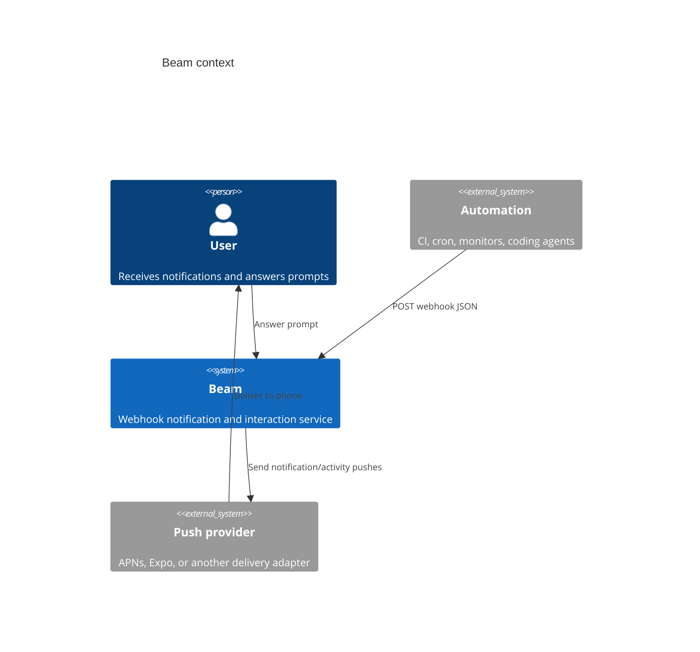
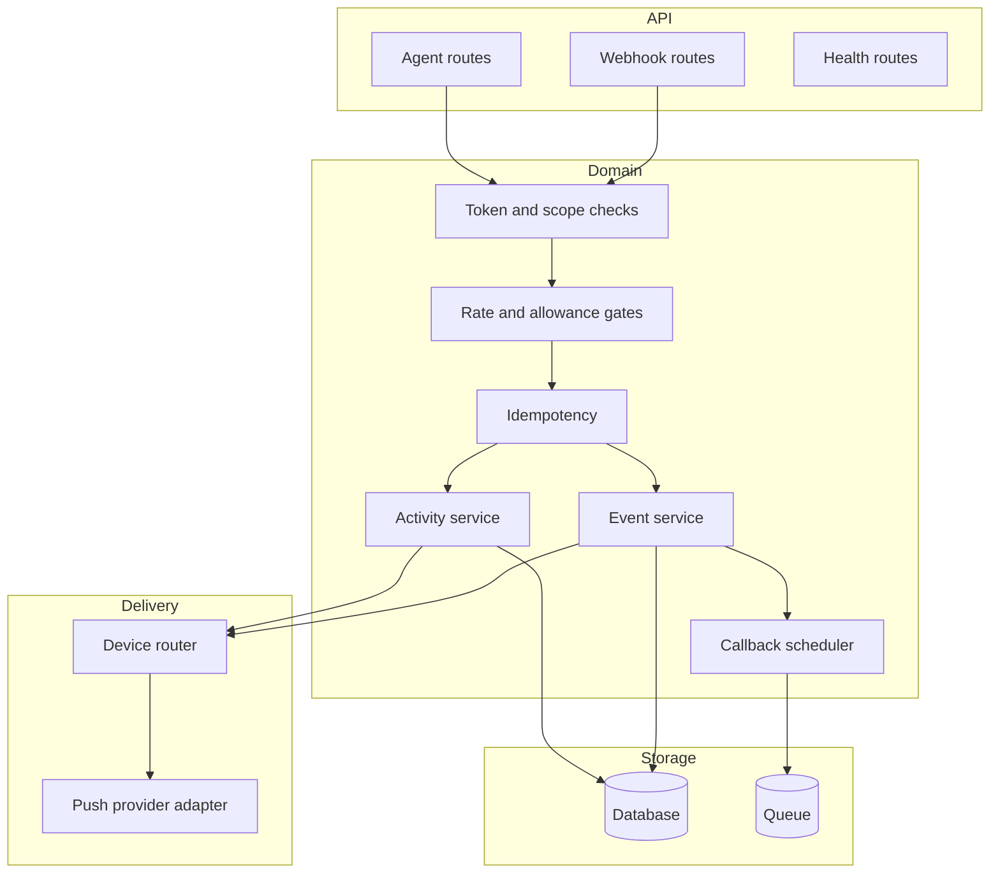
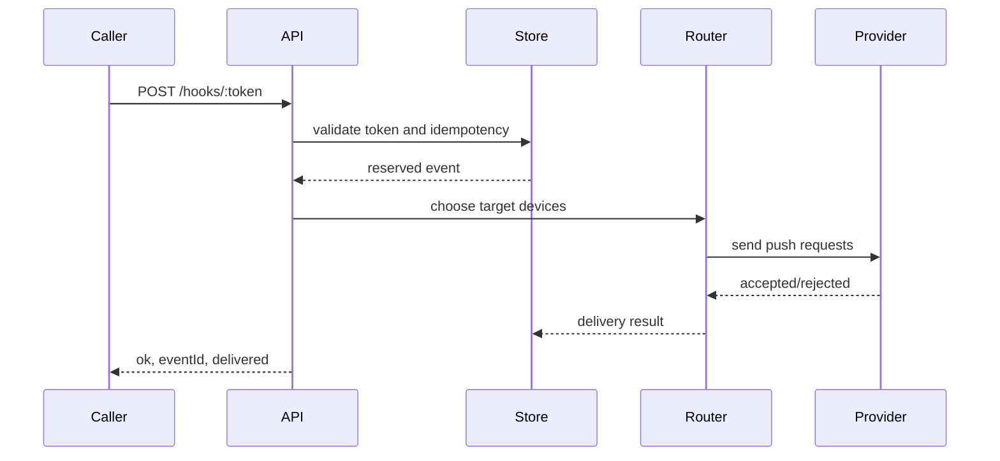
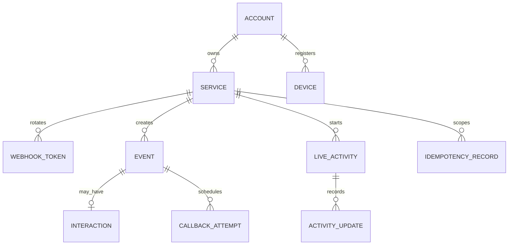
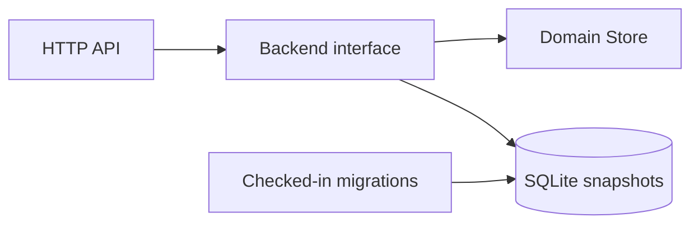
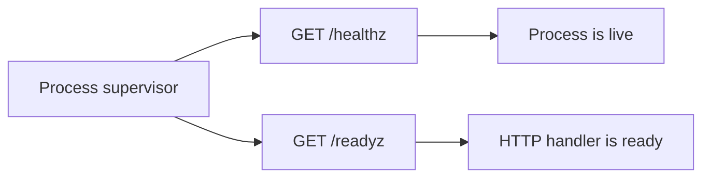

# Architecture

Beam has three surfaces: webhook callers, authenticated CLI clients, and device
callbacks. The current implementation keeps state in memory; the target
architecture swaps that package behind durable repositories and provider
adapters.

## Context

## Components

## Request lifecycle

## State boundaries

Service management is intentionally token-safe: public service views include
metadata and device counts, while plaintext webhook tokens are emitted only at
creation or rotation time. Agent connection state stores hashed bearer
credentials and token-safe client metadata. Rotating a token removes the old
token from the webhook lookup map, so old webhook URLs immediately return
`404`. The store keeps only SHA-256 token hashes in snapshots; legacy plaintext
service and agent-token snapshots are normalized to hash keys on load.

Devices are service-scoped records with stable IDs, platform, active state, and
timestamps. Notification routing validates requested IDs against active devices;
deactivated devices remain visible for history but no longer accept routed
notifications. Delivery paths call a `PushProvider` boundary and attach
token-safe provider diagnostics to events and Live Activities. The default
`LocalPushProvider` preserves development behavior by accepting active local
device targets and recording skipped diagnostics when no active device is
available. Future APNs, Expo, or other adapters plug into the same interface
and can record accepted, skipped, and failed attempts without exposing push
credentials. Provider-wide failures are persisted as redacted failed
diagnostics before Beam returns `502` to the caller. iOS devices may store
notification and Live Activity push-to-start tokens for provider delivery, but
API and CLI device views only expose whether those tokens are registered.

The first production-facing adapter is `HTTPPushProvider`. `beam serve
--provider http --provider-url ...` posts delivery jobs containing operation,
event or activity ID, target device IDs, token-safe notification or activity
content, private per-device token material, and creation time to an external
worker. The provider bearer token is sent only as an Authorization header and is
never included in provider diagnostics or caller responses. Device push tokens
are sent only to the isolated worker and are never included in Beam API
responses. This keeps APNs or Expo credentials isolated in the worker while Beam
retains the same route, idempotency, budget, and diagnostic contract. The
built-in APNs worker mode mints ES256 provider tokens from a `.p8` key, posts
notification and Live Activity requests to APNs, and maps provider HTTP
statuses back into token-safe diagnostics. Expo worker mode posts notification
requests to Expo Push Service and maps Expo tickets to the same diagnostics;
Live Activity operations remain APNs or custom-worker responsibilities.

Rate and monthly allowance accounting lives on service aggregates and optional
shared account aggregates. Notification sends and Live Activity writes consume
the same operation budget at both layers, while successful idempotent replays
return the original result without incrementing usage.

## Current durable storage

Beam now has a SQLite-backed backend for the development server. The current
implementation persists a JSON domain snapshot after successful mutating
operations and loads that snapshot on startup. This is intentionally smaller
than the target normalized schema, but it satisfies the first durable-storage
step: services, events, activities, callback attempt schedules and delivery
outcomes, limiter usage, and idempotency records survive a restart and
migrations are checked into the repo. See [Operations](operations.md) for the
backup and restore runbook.

## Operational probes

`/healthz` is the liveness probe. `/readyz` is the readiness probe and returns
the same JSON shape while Beam has no external dependency warm-up gate.

`/metrics` exposes Prometheus text metrics. The initial runtime series cover
HTTP request count, cumulative request latency, accepted delivery count,
scheduled callback attempts, rate-limited responses, and provider failure
responses. Provider failure metrics currently count `502` API responses; the
future push provider adapter should also record provider-native rejection
categories.

## Abuse boundaries

Beam's public deployment controls sit before delivery. Token lookup isolates
services, shared operation budgets cap notification and Live Activity writes,
device-routing entitlements gate targeted fanout, public URL validation blocks
private-network callbacks and media fetches, and 24-hour idempotency retention
keeps retries from duplicating work. See [Operations](operations.md) for the
operator checklist.

## LOC budget

Beam should avoid large multi-responsibility files. The current budget is 500
lines by default with explicit documentation exceptions in
`scripts/file-size-budgets.json`. Flat directories default to 12 direct files,
with narrow exceptions for the root and `cmd`.
