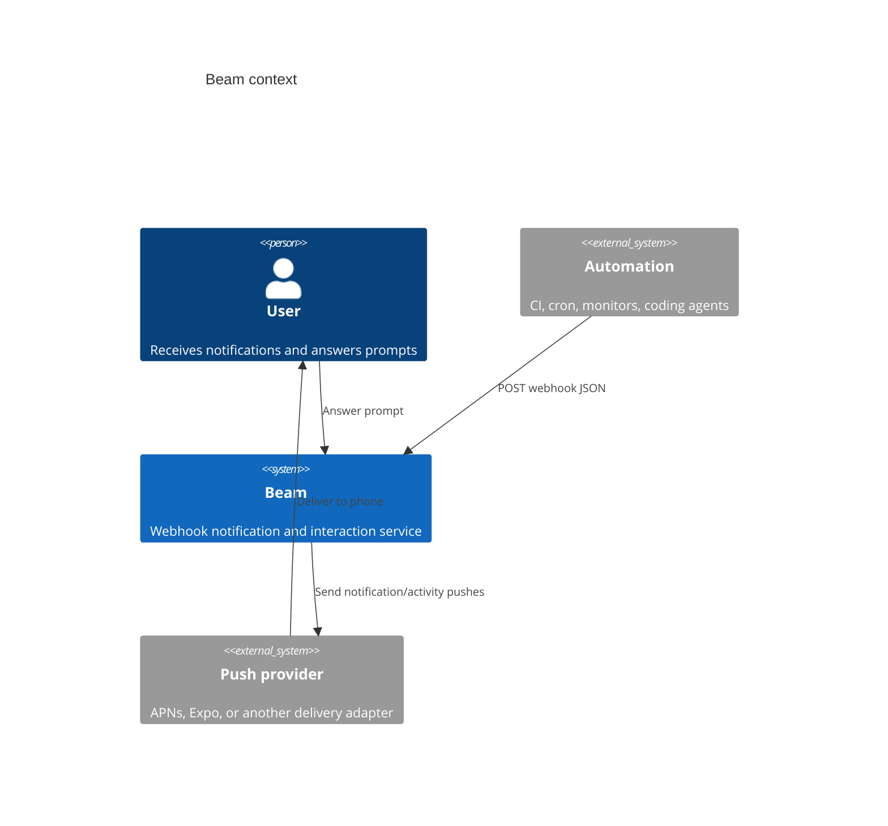
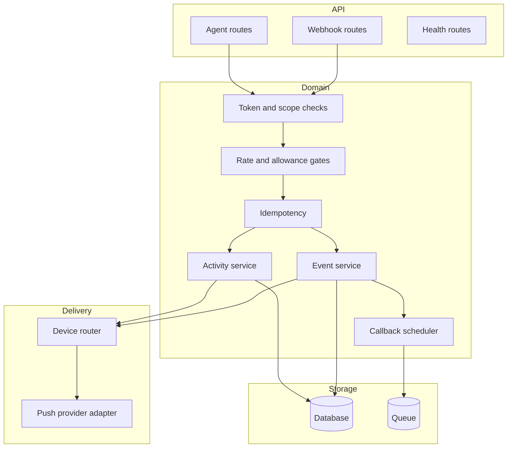
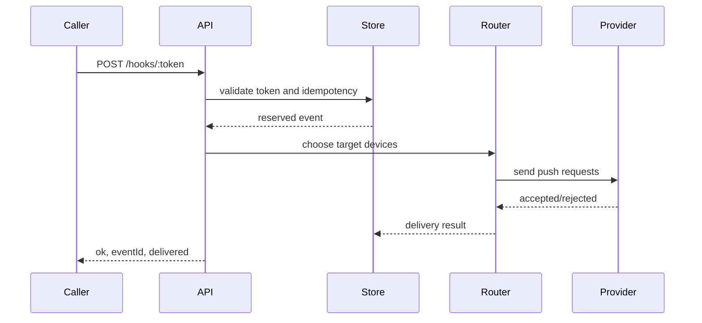
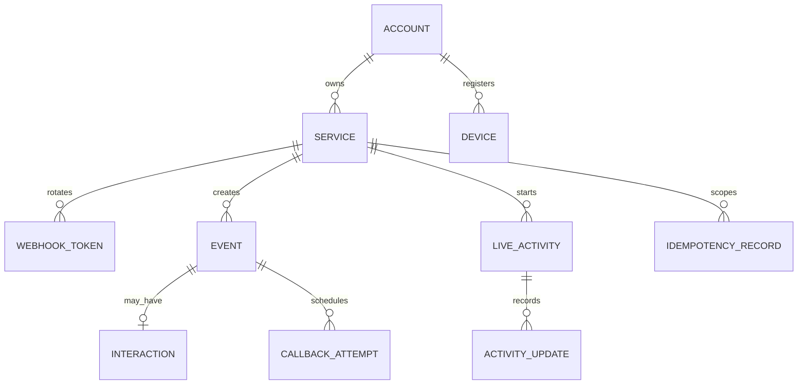
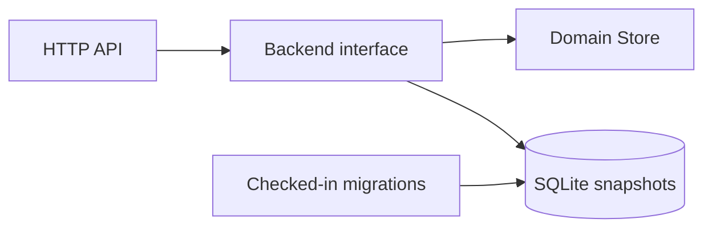

# Architecture

Beam has three surfaces: webhook callers, authenticated CLI clients, and device
callbacks. The current implementation keeps state in memory; the target
architecture swaps that package behind durable repositories and provider
adapters.

## Context

## Components

## Request lifecycle

## State boundaries

Service management is intentionally token-safe: public service views include
metadata and device counts, while plaintext webhook tokens are emitted only at
creation or rotation time. Rotating a token removes the old token from the
webhook lookup map, so old webhook URLs immediately return `404`.

Devices are service-scoped records with stable IDs, platform, active state, and
timestamps. Notification routing validates requested IDs against active devices;
deactivated devices remain visible for history but no longer accept routed
notifications.

## Current durable storage

Beam now has a SQLite-backed backend for the development server. The current
implementation persists a JSON domain snapshot after successful mutating
operations and loads that snapshot on startup. This is intentionally smaller
than the target normalized schema, but it satisfies the first durable-storage
step: services, events, activities, and idempotency records survive a restart
and migrations are checked into the repo.

## LOC budget

Beam should avoid large multi-responsibility files. The current budget is 500
lines by default with explicit documentation exceptions in
`scripts/file-size-budgets.json`. Flat directories default to 12 direct files,
with narrow exceptions for the root and `cmd`.
