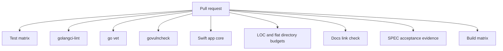

# CI and budgets

Beam CI is intentionally broad and cheap.

Operational runbooks, including backup and restore, live in
[Operations](operations.md).



## Gates

| Gate | Command |
|---|---|
| Tests with race detector | `go test -race -coverprofile=coverage.out ./...` |
| Coverage report | `go tool cover -func=coverage.out` |
| Lint | `golangci-lint run` |
| Vet | `go vet ./...` |
| Vulnerabilities | `govulncheck ./...` |
| iOS host manifest | `python3 scripts/check_ios_host_manifest.py` |
| iOS app core | `cd ios && swift test` |
| File size budget | `python3 scripts/check_file_sizes.py` |
| Flat directory budget | `python3 scripts/check_flat_directories.py` |
| Docs links | `python3 scripts/check_docs_links.py` |
| SPEC acceptance evidence | `python3 scripts/check_spec_acceptance.py` |
| Build | `go build -o beam .` |

## Local

```sh
make ci
```

The default file-size budget is 500 lines. The flat-directory budget is 12
direct tracked files. Exceptions must be explicit JSON entries with a reason
when directory-level.
