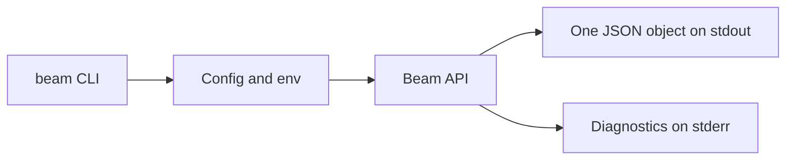

# CLI

Beam CLI commands are designed for scripts and coding agents.



Successful commands reserve stdout for one JSON object. Failed commands print a
diagnostic line to stderr and leave stdout empty so scripts can branch on the
exit code without parsing partial output.

## Configuration

`beam config init` writes local config and prints one JSON object:

```json
{"created":true,"ok":true,"path":"~/.config/beam/config.yaml"}
```

The config file contains:

```yaml
api_url: http://127.0.0.1:8080
token: dev_token
```

Target behavior adds `BEAM_API_URL` and `BEAM_TOKEN` overrides, browser auth,
scopes, client names, expiration, status, logout, and revocation.

`BEAM_API_URL` and `BEAM_TOKEN` override file config for one-off scripts:

```sh
BEAM_API_URL=https://beam.example.com BEAM_TOKEN=beam_xxx beam notify "Shipped"
```

Local credentials are stored in the config file with mode `0600`:

```sh
beam auth login --token beam_xxx \
  --scope notify \
  --scope activity \
  --client-name CI \
  --expires-in 24h
beam auth login --scope notify --client-name "Nick's Mac"
beam auth status
beam auth logout --revoke
```

Without `--token` or `BEAM_TOKEN`, `auth login` starts browser/device
authorization, opens the verification URL in the default browser when possible,
prints the user code and verification URL to stderr for headless terminals,
polls until approved, and stores the returned token. `auth logout --revoke`
revokes device-issued credentials before clearing local config.

## Notification commands

```sh
beam notify "Build 48 passed" \
  --title CI \
  --image https://example.com/ci.png \
  --url https://ci.example.com/builds/48 \
  --device dev_iphone \
  --device dev_ipad \
  --strict \
  --idempotency-key build-48
```

Read the notification body from stdin when another process already owns the
message text:

```sh
git log -1 --pretty=%B | beam notify --stdin --title Git
```

Notification commands print the API JSON response. A response with
`delivered: 0` exits successfully by default so missing devices do not fail a
build. Add `--strict` when automation should treat no accepted device as exit
code `7`.

## Service commands

```sh
beam services create --title CI --url https://ci.example.com
beam services list
beam services update svc_abc --title Deploys
beam services devices register svc_abc --name "Nick's iPhone"
beam services devices register svc_abc --name "Nick's iPhone" \
  --push-to-start-token "$BEAM_PUSH_TO_START_TOKEN"
beam services devices list svc_abc
beam services devices deactivate svc_abc dev_123
beam services rotate-token svc_abc
beam services delete svc_abc
```

`create` and `rotate-token` print the webhook token once. `list` and `show`
return token-safe service objects. Device registration accepts Live Activity
push-to-start tokens, but device output only reports
`pushToStartTokenRegistered`.

## Prompt commands

```sh
beam ask "Deploy to production?" --approval --wait \
  --expires-in 15m --timeout 15m --poll 2s
beam notify ask "Deploy to production?" --approval --expires-in 15m
beam interaction wait evt_abc --timeout 15m --poll 2s
```

`ask --wait` and `interaction wait` return exit code `4` for timed out,
expired, or canceled prompts and `5` for denied or no responses. `--expires-in`
controls prompt expiry, while `--timeout` controls how long the CLI waits. Add
`--strict` to `ask` or `notify ask` when a prompt with `delivered: 0` should
return exit code `7`.

## Activity commands

```sh
beam activity start --key deploy --replace --style ring \
  --title "Deploy #184" --status "Building" --progress 0.1 \
  --detail "Compiling" --expires-in 2h --stale-after 10m \
  --device dev_local --strict --idempotency-key deploy-184

beam activity update deploy --status "Testing" --progress 0.6 \
  --detail "Running integration tests" --if-sequence 2
beam activity get deploy
beam activity list
beam activity end deploy --status "Shipped" --progress 1 \
  --if-sequence 3 --dismiss-after 1h
```

Activity start, update, and end commands print the API JSON response before
exiting successfully by default. Add `--strict` to return exit code `7` when
the response reports `accepted: 0`.
Activity durations use Go-style values such as `30s`, `10m`, and `2h`.
`--if-sequence` performs optimistic concurrency checks, and
`--idempotency-key` makes start retries safe.

## Exit codes

| Code | Meaning |
|---:|---|
| 0 | success, approved, yes, or replied |
| 1 | API error |
| 2 | usage error |
| 3 | authentication or scope error |
| 4 | timed out, canceled, or expired |
| 5 | denied or no |
| 6 | network error |
| 7 | no device accepted the push |
