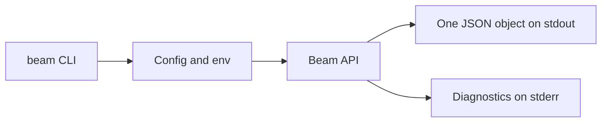

# CLI

Beam CLI commands are designed for scripts and coding agents.



## Configuration

`beam config init` writes:

```yaml
api_url: http://127.0.0.1:8080
token: dev_token
```

Target behavior adds `BEAM_API_URL` and `BEAM_TOKEN` overrides, browser auth,
scopes, client names, expiration, status, logout, and revocation.

## Notification commands

```sh
beam notify "Build 48 passed" \
  --title CI \
  --image https://example.com/ci.png \
  --url https://ci.example.com/builds/48 \
  --idempotency-key build-48
```

Target behavior adds repeatable `--device` and `--stdin`.

## Service commands

```sh
beam services create --title CI --url https://ci.example.com
beam services list
beam services update svc_abc --title Deploys
beam services rotate-token svc_abc
beam services delete svc_abc
```

`create` and `rotate-token` print the webhook token once. `list` and `show`
return token-safe service objects.

## Prompt commands

```sh
beam ask "Deploy to production?" --approval --wait --timeout 15m
```

Target behavior should also expose a `notify ask` alias, `--poll`, prompt
expiry flags, and `interaction wait <id>` for resuming a wait.

## Activity commands

```sh
beam activity start --key deploy --replace --style ring \
  --title "Deploy #184" --status "Building" --progress 0.1

beam activity update deploy --status "Testing" --progress 0.6
beam activity end deploy --status "Shipped" --progress 1
```

## Exit codes

| Code | Meaning |
|---:|---|
| 0 | success, approved, yes, or replied |
| 1 | API error |
| 2 | usage error |
| 3 | authentication or scope error |
| 4 | timed out, canceled, or expired |
| 5 | denied or no |
| 6 | network error |
| 7 | no device accepted the push |
