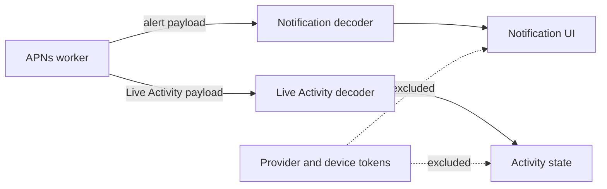

# iOS App Core

Beam's iOS surface starts as a Swift package under `ios/` so push payload
handling can be compiled and tested without requiring a signing identity. The
package models the APNs payloads emitted by `beam provider-worker --mode apns`
and keeps provider credentials outside app-visible data structures.



## Package Layout

```text
ios/
  Package.swift
  Sources/BeamAppCore/
  Tests/BeamAppCoreTests/
```

`BeamAppCore` currently decodes:

- one-shot notification payloads with `aps.alert.title` and `aps.alert.body`
- Live Activity payloads with `aps.event`, `content-state`, and
  `beam-sequence`
- the Beam Live Activity fields used by the server contract: title, status,
  detail, progress, symbol, accent color, layout style, and privacy mode

The package intentionally ignores APNs provider headers, bearer tokens, and
device push tokens. Those values belong in the provider worker and must not
appear in iOS app state, logs, or UI.

## Verification

Run the app-core tests locally:

```sh
cd ios
swift test
```

CI runs the same command on macOS. A future app slice should add the SwiftUI
target, APNs registration plumbing, and ActivityKit rendering on top of this
tested payload boundary.
