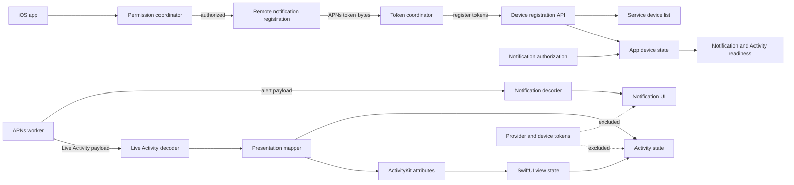

# iOS App Core

Beam's iOS surface starts as a Swift package under `ios/` so push payload
handling can be compiled and tested without requiring a signing identity. The
package models the APNs payloads emitted by `beam provider-worker --mode apns`
and keeps provider credentials outside app-visible data structures.



## Package Layout

```text
ios/
  Package.swift
  Sources/BeamAppCore/
  Tests/BeamAppCoreTests/
```

`BeamAppCore` currently decodes:

- one-shot notification payloads with `aps.alert.title` and `aps.alert.body`
- Live Activity payloads with `aps.event`, `content-state`, and
  `beam-sequence`
- the Beam Live Activity fields used by the server contract: title, status,
  detail, progress, symbol, accent color, layout style, and privacy mode
- device registration requests for iOS notification tokens and Live Activity
  push-to-start tokens
- token-safe device registration responses with `pushTokenRegistered` and
  `pushToStartTokenRegistered`
- APNs token coordination that hex-encodes notification device-token bytes and
  submits optional Live Activity push-to-start tokens through the registrar
- notification permission orchestration that requests local authorization and
  triggers APNs registration only when notification delivery is allowed
- app-facing device state that combines Beam's active device record with local
  notification authorization and token registration readiness
- display-ready Live Activity presentation data for progress, symbol, layout,
  privacy, accent color, and sequence rendering
- ActivityKit attributes and content state that bridge Beam's activity identity
  and presentation fields into Apple's Live Activity runtime model
- SwiftUI-ready Live Activity view state for progress labels, SF Symbols,
  sequence display, layout selection, and private-detail redaction

The package intentionally ignores APNs provider headers, bearer tokens, and
device push tokens when decoding app-visible responses. Provider credentials
belong in the provider worker and must not appear in iOS app state, logs, or UI.
Device push tokens are sent only in registration requests and are represented
as boolean registration flags after the server accepts them.

## Device Registration

The app-core registration builder creates:

```text
POST /api/services/:serviceId/devices
Authorization: Bearer <agent token>
Content-Type: application/json
```

with the server contract:

```json
{
  "name": "Nick's iPhone",
  "platform": "ios",
  "pushToken": "...",
  "pushToStartToken": "..."
}
```

Registration responses are decoded into token-safe device records. They expose
stable IDs, active state, and registration booleans rather than echoing APNs
token material.

`BeamDeviceRegistrar` wraps this request/response contract behind an async
Swift boundary with injectable HTTP transport. App code can collect APNs tokens
from `UIApplicationDelegate` or ActivityKit, build `BeamDeviceRegistration`,
and call the registrar without coupling the rest of the UI to JSON encoding,
authorization headers, or HTTP status handling.

`BeamAPNSTokenCoordinator` is the app-facing bridge for APNs callbacks. It
turns raw notification device-token bytes into the lowercase hexadecimal string
Beam stores, preserves optional ActivityKit push-to-start token strings, and
submits both through the registrar with the configured device name.

`BeamNotificationPermissionCoordinator` owns the pre-token app flow. It wraps
the local notification authorization request behind `BeamNotificationAuthorizing`
and remote APNs registration behind `BeamRemoteNotificationRegistering`, updates
`BeamAppDeviceState` with the resulting authorization, and only asks the
platform to register for remote notifications when authorization allows
delivery.

`BeamAppDeviceState` combines the token-safe `BeamDevice` response with local
notification authorization. It exposes a small registration status enum plus
`canReceiveNotifications` and `canStartLiveActivities` booleans so the app can
separate server registration, active/inactive device state, iOS-only routing,
and local permission state before showing UI affordances or reporting readiness
to the user.

## Live Activity Presentation

`BeamLiveActivityPresentation` maps decoded `content-state` payloads into a
stable rendering model for future SwiftUI and ActivityKit targets. It preserves
the Beam title, status, detail, accent color, layout style, privacy mode, and
sequence number; converts symbol, layout, and privacy strings into typed enums;
and clamps progress into 0..1 before deriving percent-complete display values.
Unknown presentation strings fall back to conservative defaults so an older app
can still render newer server payloads.

`BeamActivityAttributes` is the concrete ActivityKit boundary. Attributes carry
the stable Beam activity ID and optional caller-provided key, while
`BeamActivityAttributes.ContentState` carries the mutable title, status, detail,
progress, symbol, accent color, layout, privacy mode, and sequence values. The
content state can be built from `BeamLiveActivityPresentation` and converted
back to the same presentation model, keeping SwiftUI views and ActivityKit push
updates on the same typed contract.

`BeamLiveActivityViewState` is the rendering adapter for the future SwiftUI
views. It maps Beam symbols to SF Symbol names, formats progress and sequence
labels, preserves layout selection, and removes detail text for private
activities before the UI layer sees it.

## Verification

Run the app-core tests locally:

```sh
cd ios
swift test
```

CI runs the same command on macOS. A future app slice should add the SwiftUI
target and concrete ActivityKit view compositions on top of this tested
permission, payload, registration, presentation, attributes, and view-state
boundary.
