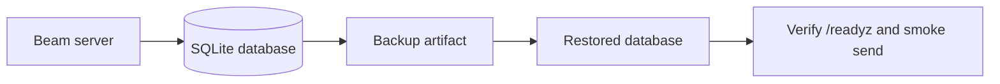

# Operations

Beam's default server stores state in SQLite. Operators should back up the
database file and its write-ahead log together, or use SQLite's online backup
command while the process is running.

## Backup and Restore



### Locate the database

The server uses `--db` when supplied. Otherwise it loads `db_path` from the
Beam config file, falling back to the default application data path.

```sh
beam serve --storage sqlite --db /var/lib/beam/beam.db
```

### Online backup

Use SQLite's `.backup` command when Beam is running:

```sh
sqlite3 /var/lib/beam/beam.db ".backup '/backups/beam-$(date +%Y%m%d%H%M%S).db'"
```

This creates a consistent database copy without stopping the process.

### Offline backup

If the Beam process is stopped, copy the database and any WAL files together:

```sh
systemctl stop beam
cp /var/lib/beam/beam.db /backups/beam.db
cp /var/lib/beam/beam.db-wal /backups/beam.db-wal 2>/dev/null || true
cp /var/lib/beam/beam.db-shm /backups/beam.db-shm 2>/dev/null || true
systemctl start beam
```

### Restore

Stop Beam, move the damaged database aside, copy the backup into place, then
start Beam with the same `--db` path:

```sh
systemctl stop beam
mv /var/lib/beam/beam.db /var/lib/beam/beam.db.broken
cp /backups/beam.db /var/lib/beam/beam.db
systemctl start beam
curl -fsS http://127.0.0.1:8080/readyz
```

After readiness succeeds, run a token-safe smoke check such as
`beam services list`. Do not paste webhook tokens or callback bearer tokens
into tickets, logs, or chat transcripts while validating a restore.
