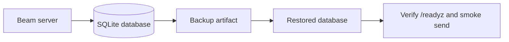

# Operations

Beam's default server stores state in SQLite. Operators should back up the
database file and its write-ahead log together, or use SQLite's online backup
command while the process is running.

## Backup and Restore



### Locate the database

The server uses `--db` when supplied. Otherwise it loads `db_path` from the
Beam config file, falling back to the default application data path.

```sh
beam serve --storage sqlite --db /var/lib/beam/beam.db
```

### Online backup

Use SQLite's `.backup` command when Beam is running:

```sh
sqlite3 /var/lib/beam/beam.db ".backup '/backups/beam-$(date +%Y%m%d%H%M%S).db'"
```

This creates a consistent database copy without stopping the process.

### Offline backup

If the Beam process is stopped, copy the database and any WAL files together:

```sh
systemctl stop beam
cp /var/lib/beam/beam.db /backups/beam.db
cp /var/lib/beam/beam.db-wal /backups/beam.db-wal 2>/dev/null || true
cp /var/lib/beam/beam.db-shm /backups/beam.db-shm 2>/dev/null || true
systemctl start beam
```

### Restore

Stop Beam, move the damaged database aside, copy the backup into place, then
start Beam with the same `--db` path:

```sh
systemctl stop beam
mv /var/lib/beam/beam.db /var/lib/beam/beam.db.broken
cp /backups/beam.db /var/lib/beam/beam.db
systemctl start beam
curl -fsS http://127.0.0.1:8080/readyz
```

After readiness succeeds, run a token-safe smoke check such as
`beam services list`. Do not paste webhook tokens or callback bearer tokens
into tickets, logs, or chat transcripts while validating a restore.

SQLite snapshots store service webhook tokens as hashes, but backups still
contain event payloads, callback metadata, device records, and limiter state.
Protect backup artifacts with the same access controls as the live database.

## Public Deployment Abuse Controls

Beam webhook tokens are bearer credentials, so public deployments should treat
every route as internet-facing automation infrastructure. The built-in controls
are service-scoped, with optional shared account budgets for groups of services,
and are meant to limit blast radius when one token leaks or one integration
loops.

```mermaid
flowchart LR
  request[Webhook request] --> token[Token lookup]
  token --> limits[Rate and monthly budgets]
  limits --> routing[Device entitlement checks]
  routing --> validation[Public URL validation]
  validation --> response[Structured API response]
  response --> metrics[/metrics counters]
```

### Service and Account Budgets

Set conservative service budgets for untrusted callers and shared account
budgets for related services. Notification sends and Live Activity writes share
the same operation budget, so a noisy progress card cannot bypass notification
limits. Rate limit failures return `429` with `retryAfter` and `resetAt`;
monthly allowance failures use the `monthly_allowance` error code.

### Device routing entitlement

Device-specific routing is an explicit entitlement. Services without that
entitlement receive `402 payment_required` when they submit `deviceIds`, which
prevents arbitrary callers from probing device IDs or forcing high-cardinality
fanout. Unknown, inactive, or cross-service device IDs fail validation before
delivery is attempted.

### Public URL validation

Avatar, tap, and callback URLs must be public HTTP(S) or HTTPS-only depending
on the field. Beam rejects localhost, `.local`, loopback, link-local, and
private-network image or callback destinations, which keeps public webhook
payloads from becoming a server-side request tunnel.

### Idempotency retention

Use `Idempotency-Key` for retrying CI jobs, monitors, and deployment scripts.
Beam retains idempotency records for 24 hours and rejects changed payloads under
the same key, reducing duplicate notifications while preventing callers from
mutating the meaning of a retry.

### Edge controls

Run Beam behind a reverse proxy that terminates TLS, caps request body size,
and applies coarse IP or network policy before traffic reaches the Go process.
Keep `/metrics` and service-management routes restricted to trusted networks or
authenticated operators. Rotate a service token immediately when a webhook URL
is pasted into logs, tickets, or chat.

### Push provider isolation

The default `local` provider is for development. Public deployments should use
`beam serve --provider http --provider-url ... --provider-token ...` and keep
APNs, Expo, or other push credentials in the external worker. The HTTP adapter
sends only token-safe event or activity IDs and target device IDs to the worker;
the provider token is transmitted as a bearer header and is never returned in
Beam API responses or provider diagnostics.

## Structured Logs

`beam serve` writes one JSON access-log record per HTTP request to stderr. Each
record includes `method`, redacted `path`, `status`, `duration_ms`, and
`remote_addr`. Webhook tokens in `/hooks/:token/...` paths and browser auth
device codes in `/api/auth/device/:deviceCode/...` paths are masked before
logging.
