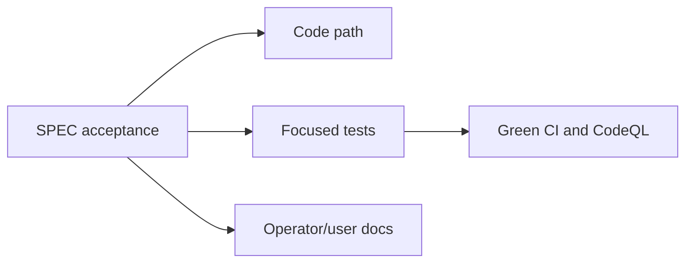

# SPEC Acceptance Evidence

This matrix tracks acceptance criteria from [SPEC.md](../SPEC.md) at a finer
grain than the milestone summary. It is evidence, not intent: completion still
requires implementation, tests, docs, and green CI on the current commit.

## Evidence Rules

- Prefer named tests over broad package coverage.
- Treat API behavior as proven only when route, status, response shape, and
  safety behavior are covered.
- Treat CLI behavior as proven only when stdout, stderr, request payload, and
  exit-code behavior are covered where applicable.
- Treat storage behavior as proven only when reopen or migration tests cover it.

## Milestone 1: Local Development Server

| Acceptance | Evidence |
|---|---|
| `beam serve` runs a local HTTP server. | `cmd/serve.go`, `TestHealthAndReadinessRoutes`, `TestOperationalEndpointsRequireGet` |
| `dev_token` is registered for local sends. | `NewStore`, `TestNotificationEndpoint`, `TestLiveActivityLifecycle` |
| `POST /hooks/dev_token` creates an event. | `TestNotificationEndpoint`, `TestNotificationEventRetainsProviderDiagnostics` |
| Idempotency replays matching payloads and rejects changed payloads. | `TestNotificationIdempotencyConflict`, `TestCompletedActivityIdempotencyReplayReturnsOK` |
| Event read and cancel routes work. | `TestResponseAnswerSchedulesCallbackAttempts`, `TestCanceledPromptDoesNotScheduleCallbackAttempts` |
| Live Activity start, read, update, and end routes work in memory. | `TestLiveActivityLifecycle`, `TestActivityListCommand`, `TestActivityGetCommand` |
| `notify`, `ask`, and `activity` commands call the API. | `TestNotifySendsPresentationRoutingAndIdempotencyFields`, `TestNotifyAskAliasSendsPrompt`, `TestActivityStartCommandSendsDevices` |

## Milestone 2: Durable Backend

| Acceptance | Evidence |
|---|---|
| Core entities persist in the database. | `TestSQLiteStorePersistsEventsAcrossReopen`, `TestSQLiteStorePersistsActivitiesAcrossReopen`, `TestSQLiteStorePersistsDevices`, `TestSQLiteStorePersistsServiceLifecycle` |
| Migrations are checked in and applied. | `internal/storage/migrations`, `TestSQLiteStoreRecordsAppliedMigrations` |
| Tokens are hashed at rest and plaintext is creation-only. | `TestSQLiteStorePersistsAgentTokenHashOnly`, `TestServicesCreatePrintsTokenOnce`, `TestServicesRotatePrintsTokenOnce` |
| Provider diagnostics persist without leaking secrets. | `TestSQLiteStorePersistsProviderFailureDiagnostics`, `TestSQLiteStorePersistsActivityProviderFailureDiagnostics`, `TestProviderWorkerReturnsTokenSafeDiagnostics` |
| Tests run against ephemeral databases. | `internal/storage` tests use temporary SQLite paths and reopen stores. |

## Milestone 3: Service Dashboard API

| Acceptance | Evidence |
|---|---|
| Create, list, update, and delete services. | `TestServiceLifecycleRoutes`, `TestServicesCreatePrintsTokenOnce`, `TestServicesListKeepsTokenSafeOutput`, `TestServicesDeleteSendsDeleteAndKeepsTokenSafeOutput` |
| Rotate webhook tokens. | `TestServiceLifecycleRoutes`, `TestServicesRotatePrintsTokenOnce` |
| Set and clear default title, image URL, and tap URL. | `TestSQLiteStoreUsesServiceNotificationDefaults`, `TestServicesUpdateCanClearDefaults`, `TestServiceUpdateCanClearURLDefaults` |
| List recent event history. | `TestServiceEventHistoryIsRecentScopedAndTokenSafe`, `TestServicesEventsCommand` |
| List devices and stable device IDs. | `TestDeviceRoutesAndRouting`, `TestServicesDevicesListKeepsTokenSafeOutput` |
| Revoke agent connections. | `TestAuthConnectionsListAndRevokeAreTokenSafe`, `TestAuthConnectionsRevokeCommand`, `TestSQLiteStorePersistsAuthConnectionRevocation` |

## Milestone 4: Notification API Parity

| Acceptance | Evidence |
|---|---|
| Body is required and length-limited after trimming. | `TestNotificationEndpoint`, `TestNotificationValidationCountsUnicodeCharacters`, `TestErrorResponsesIncludeBranchableCodes` |
| Title defaults and is limited. | `TestNotificationBlankTitleUsesServiceDefault`, `TestManagementValidationCountsUnicodeCharacters` |
| Image URL allows public HTTPS and rejects unsafe hosts. | `TestNotificationValidationRejectsPrivateImageURL`, `TestPublicHTTPSValidationRejectsEmbeddedCredentials` |
| Tap URL allows only HTTP and HTTPS. | `TestNotificationEndpoint`, `TestErrorResponsesIncludeBranchableCodes` |
| Device IDs accept 1..50 owned devices when enabled. | `TestNotificationRejectsInvalidDeviceIDLists`, `TestDeviceRoutesAndRouting` |
| Unknown or rotated tokens return `404`. | `TestServiceLifecycleRoutes`, `TestErrorResponsesIncludeBranchableCodes` |
| Invalid payloads return `400` with field issues. | `TestNotificationValidationCountsUnicodeCharacters`, `TestErrorResponsesIncludeBranchableCodes` |
| Device routing without entitlement returns `402`. | `TestDeviceRoutingWithoutEntitlementReturnsPaymentRequired` |
| Rate limits return `429` with retry hints. | `TestNotificationRateLimitReturnsRetryHints`, `TestRateLimitIncrementsMetrics` |
| Provider-wide failure can return `502`. | `TestNotificationProviderFailureReturnsBadGateway`, `TestProviderFailureReturnsBadGateway` |
| No registered device returns success with `delivered: 0` and a message. | `TestNotificationWithNoRegisteredDevicesReturnsMessage`, `TestNotifyNoDeviceAccepted` |

## Milestone 5: Idempotency

| Acceptance | Evidence |
|---|---|
| `Idempotency-Key` is optional. | `TestNotificationEndpoint`, `TestLiveActivityLifecycle` |
| Blank or over-length keys return `400`. | `TestBlankNotificationIdempotencyKeyReturnsBadRequest`, `TestBlankActivityIdempotencyKeyReturnsBadRequest` |
| Keys are scoped per service or agent connection. | `TestActivitiesAreScopedToServiceTokens`, `TestEventsFromAnotherServiceAreInvisible` |
| Matching payload replays original response with `idempotent: true`. | `TestCompletedActivityIdempotencyReplayReturnsOK`, `TestSQLiteStoreReplaysActivityIdempotencyAcrossReopen` |
| Matching in-flight payload returns `202`. | `TestMatchingIdempotencyKeyReturnsAcceptedWhileNotificationInFlight`, `TestMatchingIdempotencyKeyReturnsAcceptedWhileActivityStartInFlight` |
| Changed payload under the same key returns `409`. | `TestNotificationIdempotencyConflict`, `TestDuplicateActivityStartConflictsWhileProviderInFlight` |
| Records expire on the documented retention schedule. | `TestExpiredIdempotencyRecordCanBeReused`, `idempotencyRetention` |

## Milestone 6: Interactive Responses

| Acceptance | Evidence |
|---|---|
| Response types are approval, yes/no, and text. | `TestInteractionWaitReturnsSuccessExitCodeForPositiveOutcomes`, `TestNotifyAskAliasSendsPrompt` |
| Expiry accepts bounds and defaults. | `TestNotificationValidationRejectsInvalidResponseExpiry`, `TestSQLiteStorePersistsPromptDefaultExpiry` |
| Correlation ID echoes through responses and callbacks. | `TestAskSendsCallbackAndCorrelation`, `TestResponseAnswerSchedulesCallbackAttempts` |
| Callback URL and token validation. | `TestPublicHTTPSValidationRejectsEmbeddedCredentials`, `TestCallbackTokenRejectsWhitespace` |
| Read settles expired pending responses. | `TestSQLiteStorePersistsExpiredLateResponse`, `TestExpiredPromptRejectsLateResponseWithoutCallbacks` |
| Cancel returns not found for non-pending responses. | `TestExpiredPromptRejectsCancelWithoutCallbacks`, `TestSQLiteStorePersistsExpiredCancel` |
| Events from another service are invisible. | `TestEventsFromAnotherServiceAreInvisible` |
| Callbacks are at-least-once and keyed by event ID. | `TestDeliverDueCallbacksPostsSettledEvent`, `TestDeliverDueCallbacksStopsRetriesAfterSuccess` |
| Retry schedule is immediate, 30s, 2m, 10m, and 1h. | `TestResponseAnswerSchedulesCallbackAttempts`, `callbackRetryDelays` |
| Expired and canceled prompts do not fire callbacks. | `TestExpiredPromptDoesNotScheduleCallbackAttempts`, `TestCanceledPromptDoesNotScheduleCallbackAttempts` |

## Milestone 7: Live Activity API

| Acceptance | Evidence |
|---|---|
| Start route returns `201`. | `TestLiveActivityLifecycle`, `TestActivityResponsesExposeProviderDiagnostics` |
| Read, patch, and end address by ID or key. | `TestLiveActivityLifecycle`, `TestLiveActivityListDeduplicatesKeys` |
| Start requires title and status. | `TestLiveActivityLifecycle`, `TestErrorResponsesIncludeBranchableCodes` |
| Update requires a state field. | `TestLiveActivityRejectsEmptyUpdate` |
| Updates merge partial state and increment sequence. | `TestLiveActivityLifecycle`, `TestActivityUpdateCommandSendsSequenceAndDetail` |
| Sequence mismatch returns `409` with current state. | `TestLiveActivitySequenceConflict`, `TestSequenceConflictIncludesCodeAndCurrentActivity` |
| Ended or expired activities reject updates. | `TestLiveActivityRejectsUpdateAfterEnd`, `TestExpiredActivityUpdateAndEndPersistTerminalState` |
| End dismiss timing is bounded. | `TestEndActivityRecordsDismissAt`, `TestActivityEndCommandSendsDismissAfterAndSequence` |
| Expiry and stale timing defaults and bounds. | `TestStartActivityAcceptsImmediateStaleAfter`, `TestUpdateActivityExtendsExpiry` |
| Nullable progress and detail are supported. | `TestUpdateActivityClearsNullableStateFields`, `TestActivityUpdateCommandCanClearDetailAndProgress` |
| Symbols, layouts, and privacy modes are supported. | `SwiftTest:liveActivityViewStateMapsEveryBeamSymbolToSystemSymbol`, `SwiftTest:liveActivityViewsCompileForEveryLayout`, `SwiftTest:liveActivityViewStateRedactsPrivateDetail` |
| One Live Activity per target device is enforced. | `TestLiveActivityEnforcesOneActivityPerDevice` |
| `replace: true` ends blockers and transfers keys. | `TestLiveActivityReplaceTransfersKey`, `TestLiveActivityReplaceByDeviceTransfersExistingKey` |
| Live Activity operations count against shared budgets. | `TestLiveActivityWritesShareMonthlyAllowance`, `TestAccountMonthlyAllowanceIsSharedAcrossServices` |

## Milestone 8: CLI Parity

| Acceptance | Evidence |
|---|---|
| Browser device authorization login. | `TestAuthLoginDeviceFlow`, `TestAuthLoginDeviceFlowContinuesWhenBrowserOpenFails` |
| Auth status and logout. | `TestAuthLoginStatusAndLogout`, `TestAuthLogoutRevoke` |
| Credentials are mode `0600`. | `TestAuthLoginStatusAndLogout` |
| Repeatable scopes, client name, and expiry. | `TestAuthLoginStatusAndLogout` |
| Environment overrides config. | `TestAuthStatusUsesEnvToken`, `TestAPIClientEnvOverrides` |
| Service commands and token-safe output. | `TestServicesCreatePrintsTokenOnce`, `TestServicesListKeepsTokenSafeOutput`, `TestServicesShowKeepsTokenSafeOutput` |
| `notify` body, presentation, routing, idempotency, and stdin. | `TestNotifySendsPresentationRoutingAndIdempotencyFields`, `TestNotifyReadsStdinAndDeviceFlags` |
| Interactive `ask` modes, wait, timeout, and resumable wait. | `TestAskWaitReturnsTimeoutExitCode`, `TestInteractionWaitReturnsSuccessExitCodeForPositiveOutcomes`, `TestInteractionWaitReturnsExpiredExitCode` |
| Activity start, update, end, get, and list. | `TestActivityStartCommandSendsAdvancedFlags`, `TestActivityUpdateCommandSendsSequenceAndDetail`, `TestActivityEndCommandSendsDismissAfterAndSequence`, `TestActivityGetCommand`, `TestActivityListCommand` |
| JSON stdout and error diagnostics. | `TestRunAPIErrorKeepsStdoutEmpty`, `TestRunWritesDiagnosticsToStderr` |
| Exit codes `0`, `4`, `5`, `7`, and API/usage/auth/network codes. | `TestExitCodeMapsErrors`, `TestNotifyStrictNoDeviceAccepted`, `TestAskStrictReturnsNoDeviceExitCode`, `TestServicesListNetworkFailureReturnsNetworkExitCode` |

## Milestone 9: iOS App And Provider Adapter

| Acceptance | Evidence |
|---|---|
| Device registration and active/inactive state. | `TestDeviceRegisterRedactsPushToStartToken`, `SwiftTest:activeRegisteredIOSDeviceCanReceiveNotifications`, `SwiftTest:inactiveDeviceBlocksNotificationsAndLiveActivities` |
| iOS-only notification routing. | `TestDeviceRoutesAndRouting`, `SwiftTest:activeRegisteredIOSDeviceCanReceiveNotifications` |
| Push-to-start token registration. | `TestDeviceRegisterRedactsPushToStartToken`, `SwiftTest:coordinatorRegistersNotificationAndPushToStartTokens` |
| Provider adapters isolate APNs, Expo, and future providers. | `TestAPNSRequestsBuildNotificationRequest`, `TestProviderWorkerExpoModeDeliversWithoutLeakingSecrets`, `TestOpenPushProviderRequiresHTTPProviderURL` |
| Provider errors are recorded and redacted. | `TestSendAPNSRequestsRecordsProviderRejection`, `TestHTTPPushProviderReturnsProviderFailureWithoutLeakingToken`, `SwiftTest:payloadModelDoesNotExposeProviderSecrets` |

## Milestone 10: Operations And Safety

| Acceptance | Evidence |
|---|---|
| Structured logs with credential redaction. | `TestAccessLog_RedactsCredentialPaths`, `TestRedactRequestPath_RedactsDeviceCodes` |
| Metrics for requests, delivery, callbacks, rate limits, provider failures, and latency. | `TestMetricsEndpointReportsRequestCounts`, `TestMetricsEndpointReportsDeliveryAndCallbackCounts`, `TestProviderFailureIncrementsMetrics`, `TestRateLimitIncrementsMetrics` |
| Health and readiness routes. | `TestHealthAndReadinessRoutes`, `TestOperationalEndpointsRequireGet` |
| Backup and restore docs. | [operations.md](operations.md) |
| Abuse controls for public deployments. | [operations.md](operations.md) |
| CI covers tests, race, build matrix, lint, vet, vuln, docs links, and LOC budgets. | [ci.md](ci.md), `.github/workflows/ci.yml`, `.github/workflows/codeql.yml` |
