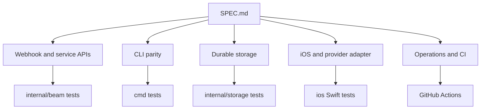
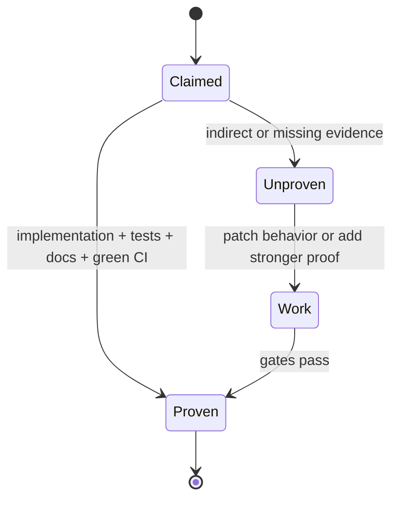

# SPEC Audit

This document tracks evidence for [SPEC.md](../SPEC.md). It is intentionally
stricter than a feature list: a milestone is only considered proven when code,
tests, docs, and CI evidence cover the acceptance criteria.

## Coverage Map

## Milestone Status

| Milestone | Current evidence | Status |
|---|---|---|
| 1. Local development server | `beam serve`, webhook routes, idempotency tests, Live Activity tests, and CLI command tests are present. | Evidence present |
| 2. Durable backend | SQLite snapshot persistence, migrations, hashed tokens, diagnostics, answered prompts, event/activity/idempotency/callback success and failure tests, and shared account allowance tests across reopen. | Evidence present |
| 3. Service dashboard API | Service CRUD, token rotation, defaults, event history, devices, and auth connection revocation are implemented and tested. | Evidence present |
| 4. Notification API parity | Body/title/media/tap URL/device validation, entitlement, limits, provider failure, unknown token, and no-device behavior are implemented and tested. | Evidence present |
| 5. Idempotency | Optional keys, blank/length validation, scoped records, replay, in-flight `202`, conflict, and retention tests exist. | Evidence present |
| 6. Interactive responses | Approval, yes/no, text, settled response persistence, expiry, cancellation, callback scheduling, failed callback persistence, and retry delivery tests exist. | Evidence present |
| 7. Live Activity API | Start/read/list/update/end, sequence conflicts, expiry/staleness, nullable fields, styles, privacy, replacement, device conflicts, and budget accounting are covered. | Evidence present |
| 8. CLI parity | Auth login/status/logout, env overrides, services, notify, ask/wait, `ask --wait` timeout exits, timed-out, canceled, and expired interaction wait exits, activity commands, JSON stdout, empty stdout on API errors, stderr diagnostics, and exit codes are covered. | Evidence present |
| 9. iOS app and provider adapter | Swift package covers device state, registration, token coordination, push payload parsing, Live Activity presentation, and platform adapters. | Evidence present |
| 10. Operations and safety | Structured logs, metrics, health/readiness, backup docs, abuse controls docs, CI, CodeQL, vuln checks, docs links, and LOC budgets are present. | Evidence present |

## Completion Standard

Before marking the overall goal complete, rerun the full gate suite and verify
that every milestone row above still has direct evidence in current code,
tests, docs, and GitHub Actions.
